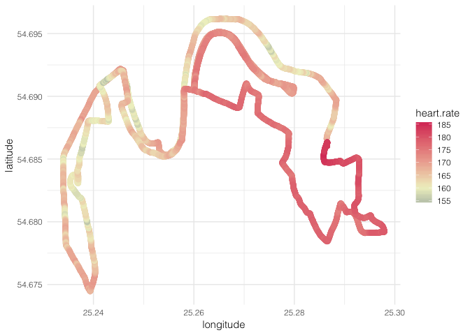

MarathonAnalysis
================
Bernadeta
2018-10-01

Import data. Runner's gender is in column "GROUP", if it starts with V, that's Male, if with M-female.

``` r
library(ggplot2)
library(ggrepel)
library(scales)
library(RColorBrewer)
library(reshape2)
library(dplyr)
library(chron) #For time conversion


setwd("~/Documents/Environments/Marathon")
MarathonDataAll <- read.delim("VilniusMarathonData.txt", 
                 header = TRUE,
                 fill=TRUE,
                 stringsAsFactors=FALSE,
                 check.names=FALSE,
                 na.strings = "NA")
head(MarathonDataAll)
```

    ##          PARTICIPANT BIB NUMBER GROUP OFFICIAL TIME      5km     10km
    ## 1  Bogdan Semenovych        813     V      02:24:23 00:17:24 00:34:25
    ## 2         Taras Salo        812     V      02:25:14 00:17:23 00:34:24
    ## 3  Dzmitry Hryhoryeu       1113     V      02:25:30 00:17:24 00:34:25
    ## 4 Stsiapan Rahautsou       1095     V      02:31:49 00:17:24 00:34:25
    ## 5     Lukas Gaigalas        630     V      02:42:57 00:18:11 00:36:24
    ## 6   Vilius Aleli_nas        337     V      02:44:14 00:18:40 00:37:22
    ##       15km     20km   21.1km   26.1km   31.1km   36.1km   41.1km Real time
    ## 1 00:51:15 01:08:13 01:11:54 01:28:20 01:45:14 02:02:20 02:20:31  02:24:22
    ## 2 00:51:14 01:08:12 01:11:53 01:28:34 01:45:31 02:03:10 02:21:22  02:25:13
    ## 3 00:51:15 01:08:29 01:12:18 01:29:34 01:46:42 02:04:11     <NA>  02:25:30
    ## 4 00:51:15 01:08:13 01:11:54 01:28:48 01:47:13 02:06:23 02:27:11  02:31:49
    ## 5 00:54:55 01:13:53 01:18:04 01:40:26 02:01:22 02:22:43 02:44:27  02:42:53
    ## 6 00:55:56     <NA> 01:18:41 01:40:22 02:00:00 02:19:51 02:40:09  02:44:13
    ##          City   Country Final_Place
    ## 1  Kivshovata   Ukraine           1
    ## 2        Lviv   Ukraine           2
    ## 3 Baranovichi  Malaysia           3
    ## 4     Mogilev   Belarus           4
    ## 5     Vilnius Lithuania           5
    ## 6     Vilnius Lithuania           6

Let's drop the 41.1km time (the final point is at 42.2km, so there's not real need for 41.1km data) and remove any participants with not all time points recorded.

``` r
MarathonDataAll$`41.1km` <- NULL
MarathonDataAll <- MarathonDataAll[complete.cases(MarathonDataAll),]
head(MarathonDataAll)
```

    ##          PARTICIPANT BIB NUMBER GROUP OFFICIAL TIME      5km     10km
    ## 1  Bogdan Semenovych        813     V      02:24:23 00:17:24 00:34:25
    ## 2         Taras Salo        812     V      02:25:14 00:17:23 00:34:24
    ## 3  Dzmitry Hryhoryeu       1113     V      02:25:30 00:17:24 00:34:25
    ## 4 Stsiapan Rahautsou       1095     V      02:31:49 00:17:24 00:34:25
    ## 5     Lukas Gaigalas        630     V      02:42:57 00:18:11 00:36:24
    ## 7    Andrius Preibys        443     V      02:44:21 00:19:16 00:38:08
    ##       15km     20km   21.1km   26.1km   31.1km   36.1km Real time
    ## 1 00:51:15 01:08:13 01:11:54 01:28:20 01:45:14 02:02:20  02:24:22
    ## 2 00:51:14 01:08:12 01:11:53 01:28:34 01:45:31 02:03:10  02:25:13
    ## 3 00:51:15 01:08:29 01:12:18 01:29:34 01:46:42 02:04:11  02:25:30
    ## 4 00:51:15 01:08:13 01:11:54 01:28:48 01:47:13 02:06:23  02:31:49
    ## 5 00:54:55 01:13:53 01:18:04 01:40:26 02:01:22 02:22:43  02:42:53
    ## 7 00:57:01 01:16:26 01:20:42 01:41:35 02:02:32 02:24:21  02:43:56
    ##          City   Country Final_Place
    ## 1  Kivshovata   Ukraine           1
    ## 2        Lviv   Ukraine           2
    ## 3 Baranovichi  Malaysia           3
    ## 4     Mogilev   Belarus           4
    ## 5     Vilnius Lithuania           5
    ## 7     Vilnius Lithuania           7

Split male vs. female and make a scatter plot. I firstly split M/F and then relabel just to M or V (there are some other groups, e.g, V40, meaning males above 40 years of age, but for this exercise I can simply group these as plain "V") and bind them again. Technically, I don't need to split the data now for a time comparison scatter plot I want to do, but I just want to have separate data frames for M/F to play with them later.

``` r
MarathonDataMale <- subset(MarathonDataAll, grepl("^V", MarathonDataAll$GROUP))
MarathonDataMale$GROUP <- "V"
MarathonDataFemale <- subset(MarathonDataAll, grepl("^M", MarathonDataAll$GROUP))
MarathonDataFemale$GROUP <- "M"
MarathonDataAll <- rbind(MarathonDataMale,MarathonDataFemale)
```

Now let's convert the 21.1km (half-marathon) and 42.2km (full-marathon) time values into minutes.

``` r
MarathonDataAll <- MarathonDataAll %>% mutate("21.1" = MarathonDataAll$`21.1km`)
MarathonDataAll <- MarathonDataAll %>% mutate("42.2" = MarathonDataAll$`Real time`)

names(MarathonDataAll)
```

    ##  [1] "PARTICIPANT"   "BIB NUMBER"    "GROUP"         "OFFICIAL TIME"
    ##  [5] "5km"           "10km"          "15km"          "20km"         
    ##  [9] "21.1km"        "26.1km"        "31.1km"        "36.1km"       
    ## [13] "Real time"     "City"          "Country"       "Final_Place"  
    ## [17] "21.1"          "42.2"

``` r
MarathonDataRealTimes <- MarathonDataAll[c("GROUP", "21.1", "42.2")]

MarathonDataRealTimes$`21.1` <- 60 * 24 * as.numeric(times(MarathonDataRealTimes$`21.1`))
MarathonDataRealTimes$`42.2` <- 60 * 24 * as.numeric(times(MarathonDataRealTimes$`42.2`))
names(MarathonDataRealTimes) <- c("group", "Half_marathon_time", "Marathon_time")
```

Let's use scatter plot half vs full-marathon times and colour them by male/female.

``` r
scatter <-ggplot(MarathonDataRealTimes, aes(x=Half_marathon_time, y=Marathon_time, color = group, alpha = group)) +
      geom_point(size = 3) +
      geom_smooth(method="lm",formula = y ~ x, se= F, size = 1, aes(linetype = group, group = group)) +
      ggtitle("Marathon Times Males(M) vs Female(F)") + 
      ylab("Marathon Time (min)") + 
      xlab("Half Marathon Time (min)") +
      theme_minimal() +
      theme(text=element_text(family="Helvetica Light"))+
      scale_alpha_discrete(range = c(0.6, 0.35))

  scatter
```


Now let's see who did a negative split, i.e. how many runners ran the second half faster then the 1st half. We will subtract the times of 1st and 2nd half of marathon for each runner, place these times in SplitTimes column and, using another scatter plot, highlight the ones who have negative values, i.e. the negative-splitters. And I'll also highlight the point, which shows my own time.

``` r
# Calculate the average pace over the 1st and the 2nd half of the marathon
MarathonDataRealTimes$SpliTtime <- with(MarathonDataRealTimes, (MarathonDataRealTimes$Marathon_time/2)-MarathonDataRealTimes$Half_marathon_time)
ggplot(MarathonDataRealTimes, aes(x = Half_marathon_time, y = Marathon_time, color = SpliTtime < 0)) +
        geom_jitter(alpha = 0.5, size = 2.5, width = 0.3, height = 0.3) +
        theme_minimal() +
        geom_point(aes(x=117.91667, y=233.3333),  size=2.5,alpha=0.002, color="black")+
        geom_text(aes(x=117.91667, y=233.3333, label="my time"),hjust=-.5, vjust=6.2, color = "black", alpha=0.003)+
        annotate("segment", x = 125, xend = 118.5, y = 200, yend = 230, colour = "black", size=1, alpha=0.3)+
        theme(text=element_text(family="Helvetica Light")) +
        labs(y = "Marathon Time (min)", x = "Half Marathon Time (min)")+
        ggtitle("Negative Split") 
```


Hey look, I've done a negative split!!!

I'd like to see how my position in the overall rankings changes overtime. We'll use a bump-plot, also known as slope plot for this. Some good examples how to do these are <a href="http://data-slinky.com/2016/07/31/bump_charts.html">here</a> and <a href="https://dominikkoch.github.io/Bump-Chart/">here</a>.

I'll only use female data for this, mainly because I care about where I am myself. I want to have position numbers for each runner at every distance, so, I'll sort runners by time on each distance and use the row numbers to assign the positions to them (note: if there are any runners with the same time they will have the different ranks just by who was faster on the previous distance point, but the final 42.2 numbers are different for all runners, so I'm not too bothered by this).

There's a very good page for creating large colour palettes (importantly, it also gives convenient output that only needs copy-pasting to the script; find in <a href="http://tools.medialab.sciences-po.fr/iwanthue/">here</a> ).

``` r
# Use split times to sort 
MarathonDataFemale <- MarathonDataFemale[order(MarathonDataFemale$`5km`),]
MarathonDataFemale <- MarathonDataFemale %>% mutate("5" = row_number())
MarathonDataFemale <- MarathonDataFemale[order(MarathonDataFemale$`10km`),]
MarathonDataFemale <- MarathonDataFemale %>% mutate("10" = row_number())
MarathonDataFemale <- MarathonDataFemale[order(MarathonDataFemale$`15km`),]
MarathonDataFemale <- MarathonDataFemale %>% mutate("15" = row_number())
MarathonDataFemale <- MarathonDataFemale[order(MarathonDataFemale$`20km`),]
MarathonDataFemale <- MarathonDataFemale %>% mutate("20" = row_number())
MarathonDataFemale <- MarathonDataFemale[order(MarathonDataFemale$`21.1km`),]
MarathonDataFemale <- MarathonDataFemale %>% mutate("21.1" = row_number())
MarathonDataFemale <- MarathonDataFemale[order(MarathonDataFemale$`26.1km`),]
MarathonDataFemale <- MarathonDataFemale %>% mutate("26.1" = row_number())
MarathonDataFemale <- MarathonDataFemale[order(MarathonDataFemale$`31.1km`),]
MarathonDataFemale <- MarathonDataFemale %>% mutate("31.1" = row_number())
MarathonDataFemale <- MarathonDataFemale[order(MarathonDataFemale$`36.1km`),]
MarathonDataFemale <- MarathonDataFemale %>% mutate("36.1" = row_number())
MarathonDataFemale <- MarathonDataFemale[order(MarathonDataFemale$`Real time`),]
MarathonDataFemale <- MarathonDataFemale %>% mutate("42.2" = row_number())

MarathonDataFemale$`BibNo` <- paste( "Runner: ", MarathonDataFemale$`BIB NUMBER`, sep="") 

MarathonDataRanks <- subset(MarathonDataFemale)[c("BibNo","5","10", "15","21.1","26.1","31.1","36.1", "42.2")]

MarathonDataRanksMelt <- melt(MarathonDataRanks)
MarathonDataRanksMelt$variable=as.numeric(levels(MarathonDataRanksMelt$variable))[MarathonDataRanksMelt$variable]


pal1 = c("#79004a","#01e463","#5416c5","#72d700","#3934db","#68df51","#8343f1","#d0cc09","#1d008e","#adb400","#9f00c5","#00a036","#ff32e6","#01d783","#e951ff","#00820d","#9661ff","#c7b000","#024edf","#fcbb31","#0063e2","#fc5500","#0285f9","#f63900","#01a1fe","#f47d00","#0040ab","#d7c850","#8900a5","#0a6900","#c000af","#00893e","#f20096","#01bc91","#fe0059","#02d3f1","#ef002a","#00c2c6","#cb000e","#1ebaff","#be2700","#9173ff","#999500","#930095","#78da97","#a8008c","#035300","#ff7bee","#003b08","#e186ff","#c6cc65","#4d0070","#ff9f33","#8289ff","#c46900","#001f65","#ff7f3c","#009ad4","#ff443a","#66dabb","#f00081","#b8cf80","#390e5a","#cacb79","#ab0071","#3f5000","#ff5dbd","#004d36","#ff4251","#007692","#ff6936","#014e90","#ffa25a","#410e4a","#e6c17c","#eda0ff","#847000","#a5a8ff","#b03f00","#86c8ff","#8d2600","#aac7f9","#a80024","#004863","#ff5272","#172b05","#d9015d","#2e3200","#ebb4f1","#946300","#ff8bc2","#5c4b00","#ff6186","#352204","#ecb6da","#a85e00","#421536","#e9be96","#51022b","#feb693","#421c29","#ffb0a7","#3f1d14","#f9b3c5","#5b0a00","#d4af96","#9a0058","#b9a483","#ca0040","#7a5e7a","#623a00","#ff81a6","#56000e","#d4a1a4","#84001d","#bf93a8","#7b0031","#ff9390","#6e4247","#a5796e")
```

And here's our bumpy road.

``` r
g1 <- ggplot(data=MarathonDataRanksMelt, aes(x=variable, y=value)) + 
  geom_line(aes(colour=BibNo), size=0.3) + 
  geom_point(shape = 21, stroke = 1, size=2, fill = "white", aes(colour=BibNo)) + 
  scale_y_reverse(lim=c(120,1), breaks = scales::pretty_breaks(n = 10)) +
  scale_x_continuous(expand = c(.12, .12), breaks = scales::pretty_breaks(n = 5)) +
  ggtitle('Marathon Bump Chart') +
  xlab("Distance (km)") +
  ylab("Position") +
  theme_bw() +
  scale_colour_manual(values=pal1) + 
  theme(panel.background = element_rect(fill = '#ffffff'),
    plot.title = element_text(size=14), legend.title=element_blank(),
    axis.text = element_text(size=11), axis.title=element_text(size=11), 
    panel.border = element_blank(), legend.position='none', 
    panel.grid.minor.x = element_blank(), panel.grid.minor.y = element_blank(),
    axis.ticks.x=element_blank(), axis.ticks.y=element_blank())+
   theme(text=element_text(family="Helvetica Light")) 
g1
```


Let's highlight just runner 562, i.e. me. and make others grey.


There's something wrong in this data, what is that group of runners that suddenly after the 21.1km shoot up the ranks. If I look back at the "raw" data, these runners somehow have times at km 31.1 are less then 21.1- clearly some faulty data here, let's remove all runners with these time recording mistakes and make a new plot.

``` r
MarathonDataFemale$suspicious <- if_else(MarathonDataFemale$`21.1km`>MarathonDataFemale$`26.1km`, "stange", "good")
MarathonDataFemale <- MarathonDataFemale[MarathonDataFemale$suspicious!="stange",]

MarathonDataFemale$suspicious <- if_else(MarathonDataFemale$`36.1km`>MarathonDataFemale$`Real time`, "stange", "good")
MarathonDataFemale <- MarathonDataFemale[MarathonDataFemale$suspicious!="stange",]

MarathonDataFemale$suspicious <- if_else(MarathonDataFemale$`15km`>MarathonDataFemale$`20km`, "stange", "good")
MarathonDataFemale <- MarathonDataFemale[MarathonDataFemale$suspicious!="stange",]

# Resort the data
MarathonDataFemale <- MarathonDataFemale[order(MarathonDataFemale$`5km`),]
MarathonDataFemale <- MarathonDataFemale %>% mutate("5" = row_number())
MarathonDataFemale <- MarathonDataFemale[order(MarathonDataFemale$`10km`),]
MarathonDataFemale <- MarathonDataFemale %>% mutate("10" = row_number())
MarathonDataFemale <- MarathonDataFemale[order(MarathonDataFemale$`15km`),]
MarathonDataFemale <- MarathonDataFemale %>% mutate("15" = row_number())
MarathonDataFemale <- MarathonDataFemale[order(MarathonDataFemale$`20km`),]
MarathonDataFemale <- MarathonDataFemale %>% mutate("20" = row_number())
MarathonDataFemale <- MarathonDataFemale[order(MarathonDataFemale$`21.1km`),]
MarathonDataFemale <- MarathonDataFemale %>% mutate("21.1" = row_number())
MarathonDataFemale <- MarathonDataFemale[order(MarathonDataFemale$`26.1km`),]
MarathonDataFemale <- MarathonDataFemale %>% mutate("26.1" = row_number())
MarathonDataFemale <- MarathonDataFemale[order(MarathonDataFemale$`31.1km`),]
MarathonDataFemale <- MarathonDataFemale %>% mutate("31.1" = row_number())
MarathonDataFemale <- MarathonDataFemale[order(MarathonDataFemale$`36.1km`),]
MarathonDataFemale <- MarathonDataFemale %>% mutate("36.1" = row_number())
MarathonDataFemale <- MarathonDataFemale[order(MarathonDataFemale$`Real time`),]
MarathonDataFemale <- MarathonDataFemale %>% mutate("42.2" = row_number())

MarathonDataRanks <- subset(MarathonDataFemale)[c("BibNo","5","10", "15","21.1","26.1","31.1","36.1", "42.2")]

MarathonDataRanksMelt <- melt(MarathonDataRanks)
MarathonDataRanksMelt$variable=as.numeric(levels(MarathonDataRanksMelt$variable))[MarathonDataRanksMelt$variable]

MarathonDataRanks2 <- MarathonDataRanks %>%
  mutate(flag = ifelse(BibNo %in% c("Runner: 562"), TRUE, FALSE),
         HighlightPoint = if_else(flag == TRUE, BibNo, "other"))

MarathonDataRanksMelt2 <- melt(MarathonDataRanks2)
MarathonDataRanksMelt2 <- MarathonDataRanksMelt2[order(MarathonDataRanksMelt2$HighlightPoint),]


ggplot(data=MarathonDataRanksMelt2, aes(x=variable, y=value, group = BibNo )) + 
  geom_line(aes(colour=HighlightPoint), size=0.3) + 
  geom_point(shape = 21, stroke = 1, size=2, fill = "white", aes(colour=HighlightPoint)) + 
  scale_y_reverse(lim=c(120,1), breaks = scales::pretty_breaks(n = 5)) +
  ggtitle('Marathon Bump Chart') +
  xlab("Distance (km)") +
  ylab("Position (among females)") +
  theme_bw() +
    scale_color_manual(values = c("grey", "#F70020")) + 
  theme(panel.background = element_rect(fill = '#ffffff'),
    plot.title = element_text(size=14), legend.title=element_blank(),
    axis.text = element_text(size=11), axis.title=element_text(size=11), 
    panel.border = element_blank(), legend.position='none', 
    panel.grid.minor.x = element_blank(), panel.grid.minor.y = element_blank(),
    axis.ticks.x=element_blank(), axis.ticks.y=element_blank())+
   theme(text=element_text(family="Helvetica Light"))
```


If you start fast, will you exhaust yourself and end up at a lower position?

``` r
# Pace over the 1st 15km
FemaleStartFinalPosition <- MarathonDataFemale
FemaleStartFinalPosition$`10` <- 60 * 24 * as.numeric(times(FemaleStartFinalPosition$`10km`))
FemaleStartFinalPosition$`BeginingPacePerMin`<- FemaleStartFinalPosition$`10`/10
FemaleStartFinalPosition$`FinalPosition`<- FemaleStartFinalPosition$`42.2`

ggplot(FemaleStartFinalPosition, aes(x = FinalPosition, y = BeginingPacePerMin)) +
        geom_jitter(alpha = 0.5, size = 2.5, width = 0.3, height = 0.3) +
        geom_smooth(method="auto",formula = y ~ x, se= F, size = 1, color = "grey")+
        theme_minimal() +
        theme(text=element_text(family="Helvetica Light")) +
        labs(y = "Initial Pace", x = "Final Position")+
        ggtitle("1st 10km pace vs position") 
```


Let's remove the elite and slow runners from the plot as outliers.

``` r
NoOfRuners <-as.numeric(nrow(FemaleStartFinalPosition))

#let's remove the 1st 10% and last 10% of runners (the "elite" and "slow" groups)
SelectToPlot <- FemaleStartFinalPosition[(NoOfRuners*0.1):(NoOfRuners-(NoOfRuners*0.1)),]

ggplot(SelectToPlot, aes(x = FinalPosition, y = BeginingPacePerMin)) +
        geom_jitter(alpha = 0.5, size = 2.5, width = 0.3, height = 0.3) +
        geom_smooth(method="lm",formula = y ~ x, se= F, size = 1, color = "grey")+
        theme_minimal() +
        theme(text=element_text(family="Helvetica Light")) +
        labs(y = "Initial Pace", x = "Final Position")+
        ggtitle("1st 10km pace vs position") 
```


Let's compare the 1st 10km pace/final position graph with the last 10km

``` r
FemaleStartFinalPosition$`31.1min` <- 60 * 24 * as.numeric(times(FemaleStartFinalPosition$`31.1km`))
FemaleStartFinalPosition$`42.2min` <- 60 * 24 * as.numeric(times(FemaleStartFinalPosition$`Real time`))
FemaleStartFinalPosition$`End10Km` <- FemaleStartFinalPosition$`42.2min`- FemaleStartFinalPosition$`31.1min`

FemaleStartFinalPosition$`EndPacePerMin`<- FemaleStartFinalPosition$`End10Km`/10
FemaleStartFinalPosition$`FinalPosition`<- FemaleStartFinalPosition$`42.2`
NoOfRuners <-as.numeric(nrow(FemaleStartFinalPosition))

#let's remove the 1st 10% and last 10% of runners (the "elite" and "slow" groups)
SelectToPlot <- FemaleStartFinalPosition[(NoOfRuners*0.1):(NoOfRuners-(NoOfRuners*0.1)),]

ggplot(SelectToPlot, aes(x = FinalPosition, y = EndPacePerMin)) +
        geom_jitter(alpha = 0.5, size = 2.5, width = 0.3, height = 0.3) +
        geom_smooth(method="lm",formula = y ~ x, se= F, size = 1, color = "grey")+
        theme_minimal() +
        theme(text=element_text(family="Helvetica Light")) +
        labs(y = "Initial Pace", x = "Final Position")+
        ggtitle("Last 10km pace vs position")
```


Well the rule to not run the 1st part of the marathon too fast does not really seems to hold here.

OK, let's do some mapping.

I've downloaded my GPS coordinates from the Fitbit that I used during the run, it also has my heart rate for every point. I'll split the map in two because the course was 2-laps and colour it by my heart rate.

``` r
library(trackeR)
library(ggmap)
runDF <- readTCX(file = "MarathonMap.tcx", timezone = "GMT") 

runDF_halfmarathon1st <- runDF[1:6790,] #Subset half marathon

ggplot(data = runDF_halfmarathon1st, aes(x = longitude, y = latitude, colour = heart.rate))+
geom_path(size = 3, lineend = "round") +
scale_colour_gradient2(low="#124E79", mid="#EFF0C8", high="#DA4067", midpoint=160 )+
theme_minimal()+
theme(text=element_text(family="Helvetica Light")) 
```


The 2nd half.

``` r
runDF_halfmarathon2nd <- runDF[6790:13926,] #Subset half marathon
ggplot(data = runDF_halfmarathon2nd, aes(x = longitude, y = latitude, colour = heart.rate))+
geom_path(size = 3,lineend = "round") +
scale_colour_gradient2(low="#124E79", mid="#EFF0C8", high="#DA4067", midpoint=160)+
theme_minimal()+
theme(text=element_text(family="Helvetica Light")) 
```



I've kept the same scale for both maps, so you can compare the two. I like how my heart rate goes up that the very end- I was trying really hard :) .

I also, downloaded my pace data, so let's plot that as well.

``` r
Pace <- read.delim("MyDistanceBPMmarathon.txt", 
                 header = TRUE,
                 fill=TRUE,
                 stringsAsFactors=FALSE,
                 check.names=FALSE,
                 na.strings = "NA")
Pace <- Pace[c("Time", "Distance (miles)", "HeartRate", "Pace(milpmin)")]

Pace$Time <- as.POSIXct(Pace$Time, format="%H:%M:%S")

ggplot(data=Pace, aes(x=Pace$Time,y=Pace$`Pace(milpmin)`, colour = Pace$`Pace(milpmin)`)) +
geom_line() +
scale_y_reverse()+
scale_colour_gradient2(low="#DA4067", mid="#F0C807", high="#124E79", midpoint=10)+
theme_minimal()+
theme(text=element_text(family="Helvetica Light"))
```


Ha! that drop in pace at ~9:35 is a porta-potty time :).

Let's have a look again at all the runners and see how many registered and finished for different genders, using a sankey network.

``` r
library(networkD3)
library(tidyverse)

setwd("~/Documents/Environments/Marathon")
MarathonDataAll <- read.delim("ALL_PARTICIPANTS.txt", 
                 header = TRUE,
                 fill=TRUE,
                 stringsAsFactors=FALSE,
                 check.names=FALSE)
TotalParticipants <- as.numeric(nrow(MarathonDataAll))

RegisteredFemale <- as.data.frame(subset(MarathonDataAll, grepl("^M", MarathonDataAll$GENDER)))
RegisteredFemaleNo <- as.numeric(nrow(RegisteredFemale))

RegisteredFemaleFinished <- subset(RegisteredFemale, grepl("^Y", RegisteredFemale$FINISHEDNOT))
RegisteredFemaleFinishedNo <- as.numeric(nrow(RegisteredFemaleFinished))

RegisteredFemaleDNF <- subset(RegisteredFemale, grepl("^N", RegisteredFemale$FINISHEDNOT))
RegisteredFemaleDNFNo <- as.numeric(nrow(RegisteredFemaleDNF))


RegisteredMale <- as.data.frame(subset(MarathonDataAll, grepl("^V", MarathonDataAll$GENDER)))
RegisteredMaleNo <- as.numeric(nrow(RegisteredMale))

RegisteredMaleFinished <- subset(RegisteredMale, grepl("^Y", RegisteredMale$FINISHEDNOT))
RegisteredMaleFinishedNo <- as.numeric(nrow(RegisteredMaleFinished))

RegisteredMaleDNF <- subset(RegisteredMale, grepl("^N", RegisteredMale$FINISHEDNOT))
RegisteredMaleDNFNo <- as.numeric(nrow(RegisteredMaleDNF))


links=data.frame(source=c("TotalParticipants","TotalParticipants", "RegisteredFemaleNo", "RegisteredFemaleNo","RegisteredMaleNo", "RegisteredMaleNo"), target=c("RegisteredFemaleNo","RegisteredMaleNo", "RegisteredFemaleFinishedNo", "RegisteredFemaleDNFNo","RegisteredMaleFinishedNo","RegisteredMaleDNFNo"), value=c(RegisteredFemaleNo,RegisteredMaleNo, RegisteredFemaleFinishedNo, RegisteredFemaleDNFNo, RegisteredMaleFinishedNo, RegisteredMaleDNFNo))

# From these flows we need to create a node data frame: it lists every entities involved in the flow
nodes=data.frame(name=c(as.character(links$source), as.character(links$target)) %>% unique())

# With networkD3, connection must be provided using id, not using real name like in the links dataframe.. So we need to reformat it.
links$IDsource=match(links$source, nodes$name)-1 
links$IDtarget=match(links$target, nodes$name)-1

sankeyNetwork(Links = links, Nodes = nodes,
              Source = "IDsource", Target = "IDtarget",
              Value = "value", NodeID = "name", 
              sinksRight=FALSE)
```


And we can show the same plot in a more familiar fashion- as a bar plot.

``` r
pcdata2 <- c(616,120)
pcdata3 <- c(180,37)
pcdata <- rbind(pcdata2,pcdata3)
colnames(pcdata)= c("Male","Female")
rownames(pcdata)=c("finished","dnf")
barplot(pcdata , border="white", space=0.04, font.axis=2, xlab="group",ylim = c(0,800))
```


Et voilà! And now let's add a little illustrator magic and here's what you get:


<p class="caption">
Marathon data analysed
</p>
